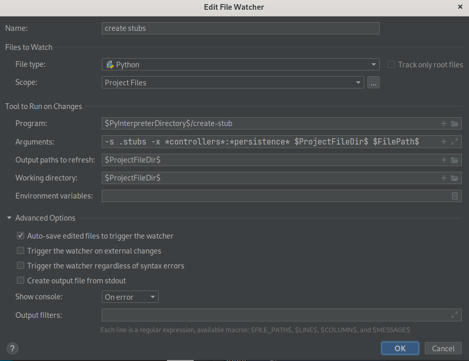

=====================
Creating Python Stubs
=====================

.. currentmodule:: typedpy

.. contents:: :local:

Stub files - Helping the IDE to Resolve Types and Offer Intellisense
====================================================================
(since version 2.15)

Since currently Pycharm does not resolve annotations dynamically, Typedpy offers a way to create a Python Interface file
(pyi file).
For that, there are two executables included with Typedpy:

1. create-stubs-for-dir - creates stubs for an entire directory recursively:
   Usage:

.. code-block:: bash

    $ create-stubs-for-dir --help
    usage: create-stubs-for-dir [-h] [-s STUBS_DIR] [-x EXCLUDE] src_root_dir directory

    positional arguments:
      src_root_dir          source root directory
      directory             directory to process

    options:
      -h, --help            show this help message and exit
      -s STUBS_DIR, --stubs-dir STUBS_DIR
                            source directory of stubs. Default is ".stubs"
      -x EXCLUDE, --exclude EXCLUDE
                            exclude patterns in the form path1:path2:path3

This is useful when you start with an existing code base. Note that you can state directories to or file patterns to \
exclude.

For example, suppose I have a directory called "common-libs", and inside it, I want to exclude files/directories related \
to Alembic or database persistence. If we are at the top level of our Python code base, a typical command would be:

.. code-block:: bash

   reate-stubs-for-dir -x "*/alembic/*:*/persistence/*" . common-lib

2. process a single python file. This is what you would use on a regular basis, to ensure the stub
   is up-to-date with your code changes (see file-watcher configuration below). Usage:

.. code-block:: bash

    $create-stub --help
    usage: create_stub [-h] [-s STUBS_DIR] [-x EXCLUDE]
                          src_root_dir src_script_path

    positional arguments:
      src_root_dir          source root directory
      src_script_path       absolute path of python script to process

    options:
      -h, --help            show this help message and exit
      -s STUBS_DIR, --stubs-dir STUBS_DIR
                            source directory of stubs. Default is .stubs
      -x EXCLUDE, --exclude EXCLUDE
                            exclude patterns in the form path1:path2:path3
      --ast, --no-ast       use AST instead of reflection(currently implemented only for sqlalchemy ORM)

As can be seen, there are two flavors for the create-stub utility:

1. no-ast - this is the default mode, and should be used for most cases. It uses reflection to analyze the code.
2. ast - uses Abstract Syntax Tree analysis. Should be used for SQLAlcemy models.

Note that Python Interface files are ignored during runtime, so if for some reason they are out-of-sync, the only
problem will be that the intellisense will not be up-to-date.

Creating Stubs For Elements That Are Not Structures
---------------------------------------------------
The above utilities support the following beyond Typedpy Structures:

1. module attributes/ constants
2. functions
3. Standard classes, dataclasses
4. Enums
5. SQLAlchemy ORM models (Use AST mode)

Configuring a File Watcher For Stub Files in Pycharm
----------------------------------------------------

1. Create a directory that will be designated for Python stub files in the project. I use ".stubs".
2. Mark the directory you created as "sources" directory in the "project structure".
3. Add the stubs directory to your .gitignore file.
4. Set up a new file watcher, with the following configuration:

5. Recommended option - change the scope to include/exclude certain files/directories, although you can achieve
   the same with the "-x" command line option.

